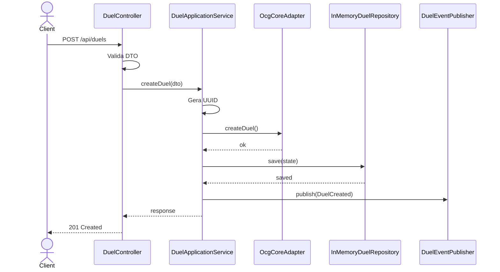
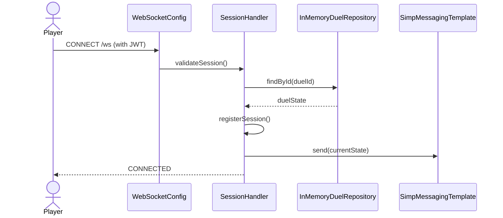

# System Feature Flows

> Registro histórico e incremental dos fluxos internos de cada funcionalidade.
> Este documento cresce a cada nova feature implementada e **nunca tem seções removidas**.

---

## Índice

- [Visão Geral da Arquitetura](#visão-geral-da-arquitetura)
- [Convenções deste Documento](#convenções-deste-documento)
- [Feature: Criação de Duelo](#feature-criação-de-duelo)
- [Feature: WebSocket/STOMP](#feature-websocketstomp)
- [Feature: Sistema de Ações](#feature-sistema-de-ações)
- [Feature: Gerenciamento de Fases](#feature-gerenciamento-de-fases)

---

## Visão Geral da Arquitetura

> Descreva aqui a arquitetura geral do sistema — uma vez, no topo. As features abaixo assumem esse contexto.

**Padrão arquitetural:** Hexagonal Architecture (Ports & Adapters)

**Fluxo global de uma requisição:**

```
HTTP Request / WebSocket Message
    └── Controller / Handler (Adapter In)
            └── Use Case (Application)
                    ├── Domain Entity / Domain Service
                    └── Repository / Gateway (Adapter Out)
                              └── Database / Native Library
```

**Camadas e responsabilidades:**

| Camada         | Responsabilidade                                                  |
|----------------|-------------------------------------------------------------------|
| `adapter/in`   | Receber requisições HTTP e WebSocket, validar DTOs, formatar resposta |
| `application` | Orquestrar o caso de uso, coordenar domínio e adapters              |
| `domain`       | Regras de negócio puras, entidades, value objects, ports interfaces |
| `adapter/out`  | Persistência, integrações externas, bibliotecas nativas          |

---

## Convenções deste Documento

- **Erros de domínio** são lançados como exceções tipadas
- **Erros de adapter out** são capturados e relançados como erros de aplicação
- **Estado** é gerenciado no nível do use case, não do repository
- **DTOs** trafegam entre adapter ↔ application; **Entidades** entre application ↔ domain
- **WebSocket messages** são enviadas via STOMP com destino `/topic/duel/{duelId}`

---

---

# Feature: Criação de Duelo

> **Versão:** 1.0.0
> **Implementada em:** 2025-01
> **Status:** Concluída

---

## Resumo

Cria um novo duelo entre dois jogadores, inicializa o estado do jogo via ocgcore e abre a sessão WebSocket para gameplay em tempo real.

**Motivação:** O community-service precisa de uma API para iniciar duelos entre jogadores que foram "matcheados" via geolocalização.
**Resultado:** Duelo criado com ID único, estado inicializado, pronto para conexões WebSocket.

---

## Fluxo Principal

### 1. Ponto de Entrada

- **Tipo:** HTTP REST
- **Arquivo:** `src/main/java/com/odevpedro/yugiohcollections/duel/adapter/in/rest/DuelController.java`
- **Rota:** `POST /api/duels`
- **Autenticação:** JWT obrigatória

```http
POST /api/duels
Content-Type: application/json
Authorization: Bearer <token>

{
  "playerAId": "uuid-player-1",
  "playerBId": "uuid-player-2"
}
```

---

### 2. Validação de Entrada

- **Arquivo:** `src/main/java/com/odevpedro/yugiohcollections/duel/application/dto/CreateDuelRequest.java`
- **Biblioteca:** Spring Validation (@Valid)

| Campo | Tipo | Obrigatório | Regra de validação |
|-------|------|-------------|---------------------|
| playerAId | UUID | Sim | Não nulo, formato UUID |
| playerBId | UUID | Sim | Não nulo, formato UUID, diferente de playerAId |

**Falha de validação:** Retorna `400 Bad Request` com detalhes dos campos inválidos.

---

### 3. Orquestração da Aplicação

- **Arquivo:** `src/main/java/com/odevpedro/yugiohcollections/duel/application/service/Impl/DuelApplicationServiceImpl.java`

O use case executa:

1. Valida que playerAId != playerBId
2. Gera UUID único para o duelo
3. Chama `ocgcore.createDuel(playerAId, playerBId)` via OcgCorePort
4. Cria DuelState inicial ( fase: DRAW, status: IN_PROGRESS, turnNumber: 1 )
5. Salva estado no repositories
6. Publica evento de duelo criado
7. Retorna DuelResponse com ID do duelo

---

### 4. Regras de Negócio

> Documente as decisões de domínio — o "porquê" das regras, não apenas o "o quê".

| Regra | Descrição | Localização no Código |
|-------|-----------|----------------------|
| Jogadores devem ser diferentes | Um jogador não pode duelar consigo mesmo | DuelApplicationServiceImpl:45 |
| Estado inicial válido | fase=DRAW, status=IN_PROGRESS, turn=1 | DuelState.java |
| ID único | UUID gerado para cada duelo | DuelApplicationServiceImpl:38 |

---

### 5. Persistência / Integrações

**Repositórios utilizados:**

| Repository | Operação | Arquivo |
|------------|----------|---------|
| InMemoryDuelRepository | save(), findById() | InMemoryDuelRepository.java |

**Integrações externas:**

| Serviço | Operação | Timeout | Retry |
|---------|----------|---------|-------|
| ocgcore (JNI) | createDuel() | 5000ms | 3x com exponential backoff |

---

### 6. Resposta Final

**Sucesso — `201 Created`:**

```json
{
  "duelId": "duel-abc-123",
  "playerAId": "uuid-player-1",
  "playerBId": "uuid-player-2",
  "currentPhase": "DRAW",
  "status": "IN_PROGRESS",
  "turnNumber": 1,
  "activePlayerId": "uuid-player-1"
}
```

**Campos retornados:**

| Campo | Tipo | Descrição |
|-------|------|-----------|
| duelId | UUID | Identificador único do duelo |
| playerAId | UUID | ID do primeiro jogador |
| playerBId | UUID | ID do segundo jogador |
| currentPhase | Phase | Fase atual do jogo |
| status | GameStatus | Status do duelo |
| turnNumber | Integer | Número do turno atual |
| activePlayerId | UUID | ID do jogador ativo |

---

## Fluxos Alternativos e Erros

| Cenário | HTTP Status | Código de Erro | Mensagem |
|---------|-------------|----------------|----------|
| playerAId == playerBId | 400 | INVALID_PLAYERS | Jogadores devem ser diferentes |
|Falha ao inicializar ocgcore | 500 | OCG_CORE_ERROR | Erro ao inicializar motor do jogo |
|dueloId já existe | 409 | DUEL_ALREADY_EXISTS | Duelo já existe |

> Todos os erros retornam o mesmo envelope:
> ```json
> { "statusCode": 0, "error": "ERROR_CODE", "message": "..." }
> ```

---

## Diagrama de Sequência



---

## Decisões Técnicas

### ADR-001 — Armazenamento em memória

| Campo | Detalhe |
|-------|---------|
| **Status** | Aceita |
| **Data** | 2025-01 |
| **Contexto** | Necessidade de estado volátil para MVP, sem persistência requerida |
| **Decisão** | Usar ConcurrentHashMap em memória para estado do duelo |
| **Consequências** | Estado é perdido em restart. Adequado para MVP, migrar para Redis posteriormente |

---

# Feature: WebSocket/STOMP

> **Versão:** 1.0.0
> **Implementada em:** 2025-01
> **Status:** Concluída

---

## Resumo

Permite conexão WebSocket para comunicação bidirecional em tempo real entre o servidor e os clientes (players). Usa STOMP sobre SockJS para compatibilidade com browsers.

**Motivação:** Duelos são em tempo real — necessidade de push de estado sem polling.
**Resultado:** Clientes conectados recebem atualizações de estado automaticamente.

---

## Fluxo Principal

### 1. Ponto de Entrada

- **Tipo:** WebSocket STOMP
- **Arquivo:** `src/main/java/com/odevpedro/yugiohcollections/duel/adapter/in/websocket/config/WebSocketConfig.java`
- **Endpoint:** `ws://localhost:8084/ws`
- **Autenticação:** JWT obrigatória (via sub-protocol ou query param)

**Subscribing:**

```javascript
stompClient.subscribe(`/topic/duel/${duelId}`, (message) => {
    const state = JSON.parse(message.body);
});
```

---

### 2. Validação de Entrada

- **Arquivo:** `src/main/java/com/odevpedro/yugiohcollections/duel/adapter/in/websocket/SessionHandler.java`
- **Biblioteca:** Spring Security

| Campo | Tipo | Obrigatório | Regra de validação |
|-------|------|-------------|---------------------|
| JWT Token | String | Sim | Token válido do auth-service |

**Falha de autenticação:** Conexão fechada com `1008 Policy Violation`.

---

### 3. Orquestração da Aplicação

- **Arquivo:** `src/main/java/com/odevpedro/yugiohcollections/duel/adapter/in/websocket/DuelActionHandler.java`, `SessionHandler.java`

O handler executa:

1. Valida JWT do handshake
2. Associa sessão STOMP ao duelId e playerId
3. Registra sessão parabroadcast de estado
4. Envia estado atual do duelo ao cliente

---

### 4. Regras de Negócio

| Regra | Descrição | Localização no Código |
|-------|-----------|----------------------|
| Sessão única por player | Um player por sessão STOMP | SessionHandler:28 |
| Broadcast para players | Estado enviado a ambos os players | SessionHandler:52 |

---

### 5. Persistência / Integrações

**Repositórios utilizados:**

| Repository | Operação | Arquivo |
|------------|----------|---------|
| InMemoryDuelRepository | findById() | InMemoryDuelRepository.java |

**Integrações externas:**

| Serviço | Operação | Timeout | Retry |
|---------|----------|---------|-------|
| SimpMessagingTemplate | send() | - | - |

---

### 6. Resposta Final

**Mensagem STOMP para `/topic/duel/{duelId}`:**

```json
{
  "duelId": "duel-abc-123",
  "currentPhase": "MAIN_1",
  "turnNumber": 1,
  "activePlayerId": "uuid-player-1",
  "players": [...],
  "zones": [...]
}
```

---

## Fluxos Alternativos e Erros

| Cenário | HTTP Status | Código de Erro | Mensagem |
|---------|-------------|----------------|----------|
| JWT inválido | 401 | UNAUTHORIZED | Token inválido ou expirado |
| Duelo não encontrado | 404 | DUEL_NOT_FOUND | Duelo não existe |
| Limite de conexões | 429 | TOO_MANY_CONNECTIONS | many players já conectados |

---

## Diagrama de Sequência



---

# Feature: Sistema de Ações

> **Versão:** 1.0.0
> **Implementada em:** 2025-03
> **Status:** Concluída

---

## Resumo

Permite que jogadores executem ações durante o duelo (SUMMON, ATTACK, SPELL, SET). Cada ação é validada e processada pelo motor ocgcore.

**Motivação:** Jogadores precisam interagir com o jogo — invocar monstros, ativar magia, atacar.
**Resultado:** Estado do duelo atualizado após cada ação válida.

---

## Fluxo Principal

### 1. Ponto de Entrada

- **Tipo:** WebSocket STOMP
- **Arquivo:** `src/main/java/com/odevpedro/yugiohcollections/duel/adapter/in/websocket/DuelActionHandler.java`
- **Destino:** `/app/duel.action`
- **Autenticação:** JWT obrigatória

```javascript
stompClient.publish({
    destination: '/app/duel.action',
    body: JSON.stringify({
        duelId: 'duel-abc-123',
        actionType: 'SUMMON',
        cardId: '42',
        zoneIndex: 2
    })
});
```

---

### 2. Validação de Entrada

- **Arquivo:** `src/main/java/com/odevpedro/yugiohcollections/duel/application/dto/DuelActionDTO.java`
- **Biblioteca:** Spring Validation

| Campo | Tipo | Obrigatório | Regra de validação |
|-------|------|-------------|---------------------|
| duelId | UUID | Sim | Formato UUID válido |
| actionType | Enum | Sim | SUMMON, ATTACK, SPELL, SET |
| cardId | String | Condicional | Obrigatório para SUMMON, SPELL |
| zoneIndex | Integer | Condicional | Obrigatório para SUMMON (0-5) |

**Falha de validação:** Retorna mensagem de erro via STOMP para o cliente.

---

### 3. Orquestração da Aplicação

- **Arquivo:** `src/main/java/com/odevpedro/yugiohcollections/duel/application/service/Impl/ActionServiceImpl.java`

O use case executa:

1. Busca estado do duelo
2. Valida que é a vez do jogador
3. Chama ocgcore.processAction() com a ação
4. Atualiza estado no repository
5. Publica novo estado para /topic/duel/{duelId}

---

### 4. Regras de Negócio

| Regra | Descrição | Localização no Código |
|-------|-----------|----------------------|
| Ação apenas na fase certa | SUMMON/SPELL em MAIN_1/MAIN_2, ATTACK em BATTLE | ActionServiceImpl:52 |
| Apenas jogador ativo | Apenas quem está na vez pode agir | ActionServiceImpl:38 |
| Recursos suficientes | Verificar custos de invocação/ativação | ocgcore |

---

### 5. Persistência / Integrações

**Repositórios utilizados:**

| Repository | Operação | Arquivo |
|------------|----------|---------|
| InMemoryDuelRepository | findById(), save() | InMemoryDuelRepository.java |

**Integrações externas:**

| Serviço | Operação | Timeout | Retry |
|---------|----------|---------|-------|
| ocgcore (JNI) | processAction() | 3000ms | 2x |

---

### 6. Resposta Final

**Sucesso:**

```json
{
  "duelId": "duel-abc-123",
  "actionType": "SUMMON",
  "success": true,
  "newState": { ... }
}
```

**Campos retornados:**

| Campo | Tipo | Descrição |
|-------|------|-----------|
| duelId | UUID | ID do duelo |
| actionType | String | Tipo de ação executada |
| success | Boolean | Se a ação foi bem-sucedida |
| newState | Object | Estado atualizado do duelo |

---

## Fluxos Alternativos e Erros

| Cenário | HTTP Status | Código de Erro | Mensagem |
|---------|-------------|----------------|----------|
| Ação fora da fase | - | INVALID_PHASE | Ação não permitida nesta fase |
| Não é sua vez | - | NOT_YOUR_TURN | Aguarde sua vez |
| Recurso insuficiente | - | INSUFFICIENT_RESOURCES | LP ou cartões insuficientes |

---

# Feature: Gerenciamento de Fases

> **Versão:** 1.0.0
> **Implementada em:** 2025-02
> **Status:** Concluída

---

## Resumo

Gerencia a transição entre fases do duelo (DRAW → STANDBY → MAIN_1 → BATTLE → MAIN_2 �� END). Valida quais ações são permitidas em cada fase.

**Motivação:** O jogo precisa Progredir automaticamente entre fases, com validação de ações permitidas.
**Resultado:** Fase atual atualizada, notificações enviadas aos jogadores.

---

## Fluxo Principal

### 1. Ponto de Entrada

- **Tipo:** WebSocket STOMP
- **Arquivo:** `src/main/java/com/odevpedro/yugiohcollections/duel/adapter/in/websocket/DuelActionHandler.java`
- **Destino:** `/app/duel.phase`
- **Autenticação:** JWT obrigatória

```javascript
stompClient.publish({
    destination: '/app/duel.phase',
    body: JSON.stringify({ duelId: 'duel-abc-123' })
});
```

---

### 2. Validação de Entrada

- **Arquivo:** `src/main/java/com/odevpedro/yugiohcollections/duel/application/dto/PhaseChangeDTO.java`

| Campo | Tipo | Obrigatório | Regra de validação |
|-------|------|-------------|---------------------|
| duelId | UUID | Sim | Formato UUID válido |

---

### 3. Orquestração da Aplicação

- **Arquivo:** `src/main/java/com/odevpedro/yugiohcollections/duel/application/service/Impl/PhaseServiceImpl.java`

O use case executa:

1. Busca estado do duelo
2. Determina próxima fase via ocgcore
3. Atualiza fase no estado
4. Se fim de turno, incrementa turnNumber e alterna jogador ativo
5. Publica novo estado

---

### 4. Regras de Negócio

| Regra | Descrição | Localização no Código |
|-------|-----------|----------------------|
| Sequência obrigatória | DRAW → STANDBY → MAIN_1 → BATTLE → MAIN_2 → END → (repete) | Phase.java |
| Fim de turno | Ao terminar END, turnNumber++ e alterna activePlayer | PhaseServiceImpl:45 |
| Ações permitidas | MAIN_1/MAIN_2: SUMMON/SPELL/SET; BATTLE: ATTACK | Phase.java |

---

### 5. Persistência / Integrações

**Repositórios utilizados:**

| Repository | Operação | Arquivo |
|------------|----------|---------|
| InMemoryDuelRepository | findById(), save() | InMemoryDuelRepository.java |

**Integrações externas:**

| Serviço | Operação | Timeout | Retry |
|---------|----------|---------|-------|
| ocgcore (JNI) |nextPhase() | 2000ms | 2x |

---

### 6. Resposta Final

**Sucesso:**

```json
{
  "duelId": "duel-abc-123",
  "previousPhase": "MAIN_1",
  "currentPhase": "BATTLE",
  "turnNumber": 1,
  "activePlayerId": "uuid-player-1"
}
```

---

## Fluxos Alternativos e Erros

| Cenário | HTTP Status | Código de Erro | Mensagem |
|---------|-------------|----------------|----------|
| Duelo finalizado | - | DUEL_ALREADY_OVER | Duelo já terminou |
| Erro na transição | - | PHASE_TRANSITION_ERROR | Falha ao cambiar de fase |