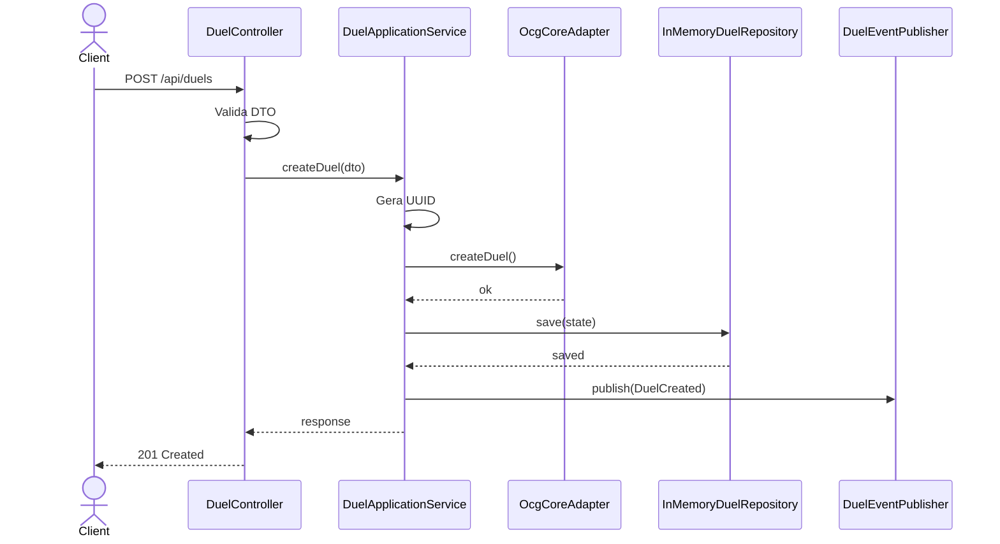
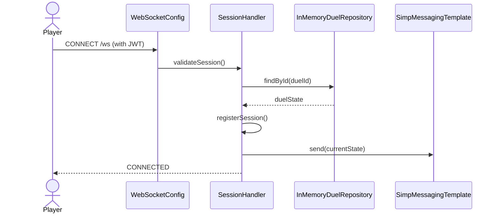

# System Feature Flows

> Registro histórico e incremental dos fluxos internos de cada funcionalidade.
> Este documento cresce a cada nova feature implementada e **nunca tem seções removidas**.
> Ultima atualizacao: 2026-07-09 — sincronizacao field_data (NATIVE-009), desenho mao pelo C++ (NATIVE-010)

---

## Índice

- [Visão Geral da Arquitetura](#visão-geral-da-arquitetura)
- [Convenções deste Documento](#convenções-deste-documento)
- [Feature: Criação de Duelo](#feature-criação-de-duelo)
- [Feature: WebSocket/STOMP](#feature-websocketstomp)
- [Feature: Autenticação JWT em WebSocket](#feature-autenticação-jwt-em-websocket)
- [Feature: Disconnect Handling com Timeout](#feature-disconnect-handling-com-timeout)
- [Feature: Persistência com Redis](#feature-persistência-com-redis)
- [Feature: Sistema de Ações](#feature-sistema-de-ações)
- [Feature: Gerenciamento de Fases](#feature-gerenciamento-de-fases)
- [Feature: Integração Nativa ocgcore (JNI Bridge)](#feature-integração-nativa-ocgcore-jni-bridge)

---

## Visão Geral da Arquitetura

> Descreva aqui a arquitetura geral do sistema — uma vez, no topo. As features abaixo assumem esse contexto.

**Padrão arquitetural:** Hexagonal Architecture (Ports & Adapters)

**Fluxo global de uma requisição:**

```
HTTP Request / WebSocket Message
    └── Controller / Handler (Adapter In)
            └── Use Case (Application)
                    ├── Domain Entity / Domain Service
                    └── Repository / Gateway (Adapter Out)
                              └── Database / Native Library
```

**Camadas e responsabilidades:**

| Camada         | Responsabilidade                                                  |
|----------------|-------------------------------------------------------------------|
| `adapter/in`   | Receber requisições HTTP e WebSocket, validar DTOs, formatar resposta |
| `application` | Orquestrar o caso de uso, coordenar domínio e adapters              |
| `domain`       | Regras de negócio puras, entidades, value objects, ports interfaces |
| `adapter/out`  | Persistência, integrações externas, bibliotecas nativas          |

---

## Convenções deste Documento

- **Erros de domínio** são lançados como exceções tipadas
- **Erros de adapter out** são capturados e relançados como erros de aplicação
- **Estado** é gerenciado no nível do use case, não do repository
- **DTOs** trafegam entre adapter ↔ application; **Entidades** entre application ↔ domain
- **WebSocket messages** são enviadas via STOMP com destino `/topic/duel/{duelId}`

---

---

# Feature: Criação de Duelo

> **Versão:** 1.0.0
> **Implementada em:** 2025-01
> **Status:** Concluída

---

## Resumo

Cria um novo duelo entre dois jogadores, inicializa o estado do jogo via ocgcore e abre a sessão WebSocket para gameplay em tempo real.

**Motivação:** O community-service precisa de uma API para iniciar duelos entre jogadores que foram "matcheados" via geolocalização.
**Resultado:** Duelo criado com ID único, estado inicializado, pronto para conexões WebSocket.

---

## Fluxo Principal

### 1. Ponto de Entrada

- **Tipo:** HTTP REST
- **Arquivo:** `src/main/java/com/odevpedro/yugiohcollections/duel/adapter/in/rest/DuelController.java`
- **Rota:** `POST /api/duels`
- **Autenticação:** JWT obrigatória

```http
POST /api/duels
Content-Type: application/json
Authorization: Bearer <token>

{
  "playerAId": "uuid-player-1",
  "playerBId": "uuid-player-2"
}
```

---

### 2. Validação de Entrada

- **Arquivo:** `src/main/java/com/odevpedro/yugiohcollections/duel/application/dto/CreateDuelRequest.java`
- **Biblioteca:** Spring Validation (@Valid)

| Campo | Tipo | Obrigatório | Regra de validação |
|-------|------|-------------|---------------------|
| playerAId | UUID | Sim | Não nulo, formato UUID |
| playerBId | UUID | Sim | Não nulo, formato UUID, diferente de playerAId |

**Falha de validação:** Retorna `400 Bad Request` com detalhes dos campos inválidos.

---

### 3. Orquestração da Aplicação

- **Arquivo:** `src/main/java/com/odevpedro/yugiohcollections/duel/application/service/Impl/DuelApplicationServiceImpl.java`

O use case executa:

1. Valida que playerAId != playerBId
2. Gera UUID único para o duelo
3. Chama `ocgcore.createDuel(playerAId, playerBId)` via OcgCorePort
4. Cria DuelState inicial ( fase: DRAW, status: IN_PROGRESS, turnNumber: 1 )
5. Salva estado no repositories
6. Publica evento de duelo criado
7. Retorna DuelResponse com ID do duelo

---

### 4. Regras de Negócio

> Documente as decisões de domínio — o "porquê" das regras, não apenas o "o quê".

| Regra | Descrição | Localização no Código |
|-------|-----------|----------------------|
| Jogadores devem ser diferentes | Um jogador não pode duelar consigo mesmo | DuelApplicationServiceImpl:45 |
| Estado inicial válido | fase=DRAW, status=IN_PROGRESS, turn=1 | DuelState.java |
| ID único | UUID gerado para cada duelo | DuelApplicationServiceImpl:38 |

---

### 5. Persistência / Integrações

**Repositórios utilizados:**

| Repository | Operação | Arquivo |
|------------|----------|---------|
| InMemoryDuelRepository | save(), findById() | InMemoryDuelRepository.java |

**Integrações externas:**

| Serviço | Operação | Timeout | Retry |
|---------|----------|---------|-------|
| ocgcore (JNI) | createDuel() | 5000ms | 3x com exponential backoff |

---

### 6. Resposta Final

**Sucesso — `201 Created`:**

```json
{
  "duelId": "duel-abc-123",
  "playerAId": "uuid-player-1",
  "playerBId": "uuid-player-2",
  "currentPhase": "DRAW",
  "status": "IN_PROGRESS",
  "turnNumber": 1,
  "activePlayerId": "uuid-player-1"
}
```

**Campos retornados:**

| Campo | Tipo | Descrição |
|-------|------|-----------|
| duelId | UUID | Identificador único do duelo |
| playerAId | UUID | ID do primeiro jogador |
| playerBId | UUID | ID do segundo jogador |
| currentPhase | Phase | Fase atual do jogo |
| status | GameStatus | Status do duelo |
| turnNumber | Integer | Número do turno atual |
| activePlayerId | UUID | ID do jogador ativo |

---

## Fluxos Alternativos e Erros

| Cenário | HTTP Status | Código de Erro | Mensagem |
|---------|-------------|----------------|----------|
| playerAId == playerBId | 400 | INVALID_PLAYERS | Jogadores devem ser diferentes |
|Falha ao inicializar ocgcore | 500 | OCG_CORE_ERROR | Erro ao inicializar motor do jogo |
|dueloId já existe | 409 | DUEL_ALREADY_EXISTS | Duelo já existe |

> Todos os erros retornam o mesmo envelope:
> ```json
> { "statusCode": 0, "error": "ERROR_CODE", "message": "..." }
> ```

---

## Diagrama de Sequência


```mermaid
sequenceDiagram
    actor Client
    participant DuelController
    participant DuelApplicationService
    participant OcgCoreAdapter
    participant InMemoryDuelRepository
    participant DuelEventPublisher

    Client->>DuelController: POST /api/duels
    DuelController->>DuelController: Valida DTO
    DuelController->>DuelApplicationService: createDuel(dto)
    DuelApplicationService->>DuelApplicationService: Gera UUID
    DuelApplicationService->>OcgCoreAdapter: createDuel()
    OcgCoreAdapter-->>DuelApplicationService: ok
    DuelApplicationService->>InMemoryDuelRepository: save(state)
    InMemoryDuelRepository-->>DuelApplicationService: saved
    DuelApplicationService->>DuelEventPublisher: publish(DuelCreated)
    DuelApplicationService-->>DuelController: response
    DuelController-->>Client: 201 Created
```

---

## Decisões Técnicas

### ADR-001 — Armazenamento em memória

| Campo | Detalhe |
|-------|---------|
| **Status** | Aceita |
| **Data** | 2025-01 |
| **Contexto** | Necessidade de estado volátil para MVP, sem persistência requerida |
| **Decisão** | Usar ConcurrentHashMap em memória para estado do duelo |
| **Consequências** | Estado é perdido em restart. Adequado para MVP, migrar para Redis posteriormente |

---

# Feature: WebSocket/STOMP

> **Versão:** 1.0.0
> **Implementada em:** 2025-01
> **Status:** Concluída

---

## Resumo

Permite conexão WebSocket para comunicação bidirecional em tempo real entre o servidor e os clientes (players). Usa STOMP sobre SockJS para compatibilidade com browsers.

**Motivação:** Duelos são em tempo real — necessidade de push de estado sem polling.
**Resultado:** Clientes conectados recebem atualizações de estado automaticamente.

---

## Fluxo Principal

### 1. Ponto de Entrada

- **Tipo:** WebSocket STOMP
- **Arquivo:** `src/main/java/com/odevpedro/yugiohcollections/duel/adapter/in/websocket/config/WebSocketConfig.java`
- **Endpoint:** `ws://localhost:8084/ws` (SockJS) ou `ws://localhost:8084/ws-raw` (raw WebSocket sem SockJS)
- **Autenticação:** JWT obrigatória (via sub-protocol ou query param)

**Subscribing:**

```javascript
stompClient.subscribe(`/topic/duel/${duelId}`, (message) => {
    const state = JSON.parse(message.body);
});
```

---

### 2. Validação de Entrada

- **Arquivo:** `src/main/java/com/odevpedro/yugiohcollections/duel/adapter/in/websocket/SessionHandler.java`
- **Biblioteca:** Spring Security

| Campo | Tipo | Obrigatório | Regra de validação |
|-------|------|-------------|---------------------|
| JWT Token | String | Sim | Token válido do auth-service |

**Falha de autenticação:** Conexão fechada com `1008 Policy Violation`.

---

### 3. Orquestração da Aplicação

- **Arquivo:** `src/main/java/com/odevpedro/yugiohcollections/duel/adapter/in/websocket/DuelActionHandler.java`, `SessionHandler.java`

O handler executa:

1. Valida JWT do handshake
2. Associa sessão STOMP ao duelId e playerId
3. Registra sessão parabroadcast de estado
4. Envia estado atual do duelo ao cliente

---

### 4. Regras de Negócio

| Regra | Descrição | Localização no Código |
|-------|-----------|----------------------|
| Sessão única por player | Um player por sessão STOMP | SessionHandler:28 |
| Broadcast para players | Estado enviado a ambos os players | SessionHandler:52 |

---

### 5. Persistência / Integrações

**Repositórios utilizados:**

| Repository | Operação | Arquivo |
|------------|----------|---------|
| InMemoryDuelRepository | findById() | InMemoryDuelRepository.java |

**Integrações externas:**

| Serviço | Operação | Timeout | Retry |
|---------|----------|---------|-------|
| SimpMessagingTemplate | send() | - | - |

---

### 6. Resposta Final

**Mensagem STOMP para `/topic/duel/{duelId}`:**

```json
{
  "duelId": "duel-abc-123",
  "currentPhase": "MAIN_1",
  "turnNumber": 1,
  "activePlayerId": "uuid-player-1",
  "players": [...],
  "zones": [...]
}
```

---

## Fluxos Alternativos e Erros

| Cenário | HTTP Status | Código de Erro | Mensagem |
|---------|-------------|----------------|----------|
| JWT inválido | 401 | UNAUTHORIZED | Token inválido ou expirado |
| Duelo não encontrado | 404 | DUEL_NOT_FOUND | Duelo não existe |
| Limite de conexões | 429 | TOO_MANY_CONNECTIONS | many players já conectados |

---

## Diagrama de Sequência


```mermaid
sequenceDiagram
    actor Player
    participant WebSocketConfig
    participant SessionHandler
    participant InMemoryDuelRepository
    participant SimpMessagingTemplate

    Player->>WebSocketConfig: CONNECT /ws (with JWT)
    WebSocketConfig->>SessionHandler: validateSession()
    SessionHandler->>InMemoryDuelRepository: findById(duelId)
    InMemoryDuelRepository-->>SessionHandler: duelState
    SessionHandler->>SessionHandler: registerSession()
    SessionHandler->>SimpMessagingTemplate: send(currentState)
    SessionHandler-->>Player: CONNECTED
```

---

# Feature: Sistema de Ações

> **Versão:** 1.0.0
> **Implementada em:** 2025-03
> **Status:** Concluída

---

## Resumo

Permite que jogadores executem ações durante o duelo (SUMMON, ATTACK, SPELL, SET). Cada ação é validada e processada pelo motor ocgcore.

**Motivação:** Jogadores precisam interagir com o jogo — invocar monstros, ativar magia, atacar.
**Resultado:** Estado do duelo atualizado após cada ação válida.

---

## Fluxo Principal

### 1. Ponto de Entrada

- **Tipo:** WebSocket STOMP
- **Arquivo:** `src/main/java/com/odevpedro/yugiohcollections/duel/adapter/in/websocket/DuelActionHandler.java`
- **Destino:** `/app/duel.action`
- **Autenticação:** JWT obrigatória

```javascript
stompClient.publish({
    destination: '/app/duel.action',
    body: JSON.stringify({
        duelId: 'duel-abc-123',
        actionType: 'SUMMON',
        cardId: '42',
        zoneIndex: 2
    })
});
```

---

### 2. Validação de Entrada

- **Arquivo:** `src/main/java/com/odevpedro/yugiohcollections/duel/application/dto/DuelActionDTO.java`
- **Biblioteca:** Spring Validation

| Campo | Tipo | Obrigatório | Regra de validação |
|-------|------|-------------|---------------------|
| duelId | UUID | Sim | Formato UUID válido |
| actionType | Enum | Sim | SUMMON, ATTACK, SPELL, SET |
| cardId | String | Condicional | Obrigatório para SUMMON, SPELL |
| zoneIndex | Integer | Condicional | Obrigatório para SUMMON (0-5) |

**Falha de validação:** Retorna mensagem de erro via STOMP para o cliente.

---

### 3. Orquestração da Aplicação

- **Arquivo:** `src/main/java/com/odevpedro/yugiohcollections/duel/application/service/Impl/ActionServiceImpl.java`

O use case executa:

1. Busca estado do duelo
2. Valida que é a vez do jogador
3. Chama ocgcore.processAction() com a ação
4. Atualiza estado no repository
5. Publica novo estado para /topic/duel/{duelId}

---

### 4. Regras de Negócio

| Regra | Descrição | Localização no Código |
|-------|-----------|----------------------|
| Ação apenas na fase certa | SUMMON/SPELL em MAIN_1/MAIN_2, ATTACK em BATTLE | ActionServiceImpl:52 |
| Apenas jogador ativo | Apenas quem está na vez pode agir | ActionServiceImpl:38 |
| Recursos suficientes | Verificar custos de invocação/ativação | ocgcore |

---

### 5. Persistência / Integrações

**Repositórios utilizados:**

| Repository | Operação | Arquivo |
|------------|----------|---------|
| InMemoryDuelRepository | findById(), save() | InMemoryDuelRepository.java |

**Integrações externas:**

| Serviço | Operação | Timeout | Retry |
|---------|----------|---------|-------|
| ocgcore (JNI) | processAction() | 3000ms | 2x |

---

### 6. Resposta Final

**Sucesso:**

```json
{
  "duelId": "duel-abc-123",
  "actionType": "SUMMON",
  "success": true,
  "newState": { ... }
}
```

**Campos retornados:**

| Campo | Tipo | Descrição |
|-------|------|-----------|
| duelId | UUID | ID do duelo |
| actionType | String | Tipo de ação executada |
| success | Boolean | Se a ação foi bem-sucedida |
| newState | Object | Estado atualizado do duelo |

---

## Fluxos Alternativos e Erros

| Cenário | HTTP Status | Código de Erro | Mensagem |
|---------|-------------|----------------|----------|
| Ação fora da fase | - | INVALID_PHASE | Ação não permitida nesta fase |
| Não é sua vez | - | NOT_YOUR_TURN | Aguarde sua vez |
| Recurso insuficiente | - | INSUFFICIENT_RESOURCES | LP ou cartões insuficientes |

---

# Feature: Gerenciamento de Fases

> **Versão:** 1.0.0
> **Implementada em:** 2025-02
> **Status:** Concluída

---

## Resumo

Gerencia a transição entre fases do duelo (DRAW → STANDBY → MAIN_1 → BATTLE → MAIN_2 �� END). Valida quais ações são permitidas em cada fase.

**Motivação:** O jogo precisa Progredir automaticamente entre fases, com validação de ações permitidas.
**Resultado:** Fase atual atualizada, notificações enviadas aos jogadores.

---

## Fluxo Principal

### 1. Ponto de Entrada

- **Tipo:** WebSocket STOMP
- **Arquivo:** `src/main/java/com/odevpedro/yugiohcollections/duel/adapter/in/websocket/DuelActionHandler.java`
- **Destino:** `/app/duel.phase`
- **Autenticação:** JWT obrigatória

```javascript
stompClient.publish({
    destination: '/app/duel.phase',
    body: JSON.stringify({ duelId: 'duel-abc-123' })
});
```

---

### 2. Validação de Entrada

- **Arquivo:** `src/main/java/com/odevpedro/yugiohcollections/duel/application/dto/PhaseChangeDTO.java`

| Campo | Tipo | Obrigatório | Regra de validação |
|-------|------|-------------|---------------------|
| duelId | UUID | Sim | Formato UUID válido |

---

### 3. Orquestração da Aplicação

- **Arquivo:** `src/main/java/com/odevpedro/yugiohcollections/duel/application/service/Impl/PhaseServiceImpl.java`

O use case executa:

1. Busca estado do duelo
2. Determina próxima fase via ocgcore
3. Atualiza fase no estado
4. Se fim de turno, incrementa turnNumber e alterna jogador ativo
5. Publica novo estado

---

### 4. Regras de Negócio

| Regra | Descrição | Localização no Código |
|-------|-----------|----------------------|
| Sequência obrigatória | DRAW → STANDBY → MAIN_1 → BATTLE → MAIN_2 → END → (repete) | Phase.java |
| Fim de turno | Ao terminar END, turnNumber++ e alterna activePlayer | PhaseServiceImpl:45 |
| Ações permitidas | MAIN_1/MAIN_2: SUMMON/SPELL/SET; BATTLE: ATTACK | Phase.java |

---

### 5. Persistência / Integrações

**Repositórios utilizados:**

| Repository | Operação | Arquivo |
|------------|----------|---------|
| InMemoryDuelRepository | findById(), save() | InMemoryDuelRepository.java |

**Integrações externas:**

| Serviço | Operação | Timeout | Retry |
|---------|----------|---------|-------|
| ocgcore (JNI) |nextPhase() | 2000ms | 2x |

---

### 6. Resposta Final

**Sucesso:**

```json
{
  "duelId": "duel-abc-123",
  "previousPhase": "MAIN_1",
  "currentPhase": "BATTLE",
  "turnNumber": 1,
  "activePlayerId": "uuid-player-1"
}
```

---

## Fluxos Alternativos e Erros

| Cenário | HTTP Status | Código de Erro | Mensagem |
|---------|-------------|----------------|----------|
| Duelo finalizado | - | DUEL_ALREADY_OVER | Duelo já terminou |
| Erro na transição | - | PHASE_TRANSITION_ERROR | Falha ao cambiar de fase |

---

# Feature: Autenticação JWT em WebSocket

> **Versão:** 1.0.0
> **Implementada em:** 2026-04-28
> **Status:** Concluída

---

## Resumo

Valida token JWT durante o handshake WebSocket STOMP. Garante que apenas usuários autenticados possam conectar aos tópicos de duelo.

**Motivação:** Proteger endpoints WebSocket com a mesma autenticação usada na API REST.
**Resultado:** Conexões WebSocket recusadas se JWT inválido ou ausente.

---

## Fluxo Principal

### 1. Ponto de Entrada

- **Tipo:** Handshake WebSocket STOMP
- **Arquivo:** `src/main/java/com/odevpedro/yugiohcollections/duel/adapter/in/websocket/config/WebSocketConfig.java`
- **Endpoint:** `/ws`
- **Autenticação:** JWT via header `Authorization: Bearer <token>`

**Conexão JavaScript:**

```javascript
const stompClient = new StompJs.Client({
    webSocketFactory: () => new SockJS('/ws'),
    connectHeaders: {
        'Authorization': 'Bearer ' + jwtToken
    }
});
```

---

### 2. Validação de Token

- **Arquivo:** `src/main/java/com/odevpedro/yugiohcollections/duel/config/JwtChannelInterceptor.java`
- **Biblioteca:** jjwt

| Campo | Tipo | Obrigatório | Regra de validação |
|-------|------|-------------|---------------------|
| Authorization | String | Sim | Deve começar com "Bearer " + token válido |

**Falha:** `IllegalArgumentException` Lanzada, conexão abortada.

---

### 3. Processamento

O interceptor executa:

1. Extrai header `Authorization`
2. Valida formato "Bearer <token>"
3. Parse JWT com chave secreta
4. Extrai claims: userId, username, role
5. Cria Principal customizado (StompPrincipal)
6. Associa ao usuário da sessão STOMP

---

### 4. Regras de Negócio

| Regra | Descrição | Localização no Código |
|-------|-----------|----------------------|
| Token obrigatório | Sem token = conexão negada | JwtChannelInterceptor:36 |
| Token deve ser válido | JWT válido e não expirado | JwtChannelInterceptor:47 |
| Claims extraídos | userId, username, role armazenados | JwtChannelInterceptor:48-51 |

---

### 5. Configuração

**application.yml:**

```yaml
jwt:
  secret: ${JWT_SECRET:mySecretKeyForJwtTokenGenerationThatIsLongEnough}
  expirationMs: 3600000
  refreshExpirationMs: 86400000
  skip-blacklist-check: true
```

| Propriedade | Descrição | Padrão |
|-------------|-----------|--------|
| jwt.secret | Chave secreta para validar tokens | - |
| jwt.expirationMs | Tempo de expiração do access token | 3600000 (1h) |
| jwt.skip-blacklist-check | Pula validação de blacklist | true |

---

### 6. Resposta Final

**Sucesso:**

- Conexão STOMP estabelecida
- Usuário autenticado disponível via `StompPrincipal`

**Erro:**

- 400 Bad Request com mensagem de erro
- Conexão WebSocket fechada

---

## Classes Criadas

| Classe | Arquivo | Descrição |
|--------|---------|-----------|
| JwtProperties | `config/JwtProperties.java` | Properties de configuração JWT |
| JwtChannelInterceptor | `config/JwtChannelInterceptor.java` | Interceptor para validar token no handshake |
| StompPrincipal | `config/StompPrincipal.java` | Principal customizado com dados do usuário |

---

## Integração com auth-service

O duel-service usa a mesma chave secreta configurada no auth-service para validar tokens. O token gerado pelo auth-service contém:

- `sub`: username
- `userId`: UUID do usuário
- `role`: role do usuário (ex: PLAYER, ADMIN)
- `exp`: data de expiração

---

# Feature: Disconnect Handling com Timeout

> **Versão:** 1.0.0
> **Implementada em:** 2026-04-28
> **Status:** Concluída

---

## Resumo

Gerencia desconexão de jogadores durante um duelo. Se um jogador desconectar, o oponente recebe notificação e vence por WO (walkover) se não houver reconexão em 3 minutos.

**Motivação:** Evitar abusode "pausar" o jogo desconnectando. Manter jogo justo.
**Resultado:** Timeout de 3min, depois opponent vence por WO.

---

## Fluxo Principal

### 1. Detecção de Disconnect

- **Arquivo:** `src/main/java/com/odevpedro/yugiohcollections/duel/adapter/in/websocket/SessionHandler.java`
- **Evento:** `SessionDisconnectEvent`

Quando um jogador se desconecta:
1. SessionHandler detecta via evento
2. Busca duelId e playerId no SessionManager
3. Atualiza DuelState com disconnectedPlayerId e timestamp

---

### 2. Notificação ao Oponente

- **Arquivo:** `src/main/java/com/odevpedro/yugiohcollections/duel/adapter/out/messaging/DuelEventPublisher.java`

Mensagem STOMP enviada para `/topic/duel/{duelId}`:

```json
{
  "type": "PLAYER_DISCONNECTED",
  "disconnectedPlayerId": "uuid-player-1",
  "timeoutSeconds": 180
}
```

---

### 3. Timeout e WO

Se o jogador não reconectar em 180 segundos:
1. SessionHandler scheduling verifica o estado
2. Define status do duelo como FINISHED
3. Oponente vence por WO
4. Publica evento em `/topic/duel/{duelId}/over` com winnerId

---

### 4. Reconexão

- **Arquivo:** `src/main/java/com/odevpedro/yugiohcollections/duel/config/JwtChannelInterceptor.java`

Quando um jogador com sessão ativa em um duelo se conecta novamente:
1. JwtChannelInterceptor detecta subscribe
2. Verifica se já havia sessão ativa para esse duelo
3. Se sim, chama sessionHandler.handlePlayerReconnect()
4. Remove status de disconnected do DuelState
5. Publica evento PLAYER_RECONNECTED

---

## Configuração

**application.yml:**

```yaml
# Timeout em segundos (padrão 180 = 3 minutos)
duel:
  disconnect-timeout-seconds: 180
```

---

## Classes Envolvidas

| Classe | Arquivo | Descrição |
|--------|---------|-----------|
| SessionManager | `adapter/in/websocket/SessionManager.java` | Mapeia sessionId → duelId, playerId |
| SessionHandler | `adapter/in/websocket/SessionHandler.java` | Lida com connect/disconnect/reconnect |
| DuelState | `domain/model/DuelState.java` | Campos disconnectedPlayerId, disconnectedAt |
| DuelEventPublisher | `adapter/out/messaging/DuelEventPublisher.java` | Publica eventos de disconnect/reconnect |

---

## Regras de Negócio

| Regra | Descrição |
|-------|-----------|
| Timeout fixo | 3 minutos (180s) para reconexão |
| WO automático | Se timeout expirar, oponente vence |
| Reconexão | Cancela processo de WO se jogador voltar |
| Apenas in_progress | Só processa se duelo está IN_PROGRESS |

---

# Feature: Integração Nativa ocgcore (JNI Bridge)

> **Versão:** 1.0.0
> **Implementada em:** 2026-07-09
> **Status:** Concluída

---

## Resumo

Conecta o motor C++ ygopro-core ao Java via JNI, permitindo que o processamento real do jogo seja delegado à biblioteca nativa em vez do stub Java.

**Motivação:** O stub Java (`OcgCoreStub`) implementa regras simplificadas e não cobre todas as mecânicas do Yu-Gi-Oh!. O ygopro-core é o motor de referência.
**Resultado:** Bridge JNI funcional que carrega ygopro-core em runtime e expõe `processAction`, `advancePhase` e `isActionValid`.

---

## Arquitetura de Integração

```
┌──────────────────────┐
│   OcgCoreAdapter     │  ←── Porta de domínio (OcgCorePort)
│   (Java/Spring)      │
└──────────┬───────────┘
           │
           ▼
┌──────────────────────┐
│   OcgCoreBridge      │  ←── Declarações `native`
│   (Java)             │
└──────────┬───────────┘
           │ JNI
           ▼
┌──────────────────────┐
│   libocgcore.so      │  ←── native/ocgcore-bridge/
│   (C++ JNI Bridge)   │      (compilado via CMake)
└──────────┬───────────┘
           │ C API (ocgcore_bridge_api.h)
           ▼
┌──────────────────────┐
│   ygopro-core         │  ←── edo9300/ygopro-core
│   (C++ Game Engine)   │      (via CMake FetchContent)
└──────────────────────┘
```

---

## Fluxo Principal

### 1. Startup — Carregamento da Lib Nativa

- **Arquivo:** `OcgCoreLoader.java`
- **Perfil ativo:** `!dev` (produção)
- **Mecanismo:** `@PostConstruct` → extrai `.so` do classpath → `System.load()`

```
Spring Boot startup
    ↓
OcgCoreLoader.load()
    ├── Recurso /native/libocgcore.so existe? ── Não → loaded=false, log warning
    │                                               → OcgCoreAdapter usa fallback
    └── Sim → copia para /tmp → System.load()
                ├── Sucesso → loaded=true, log info
                └── Falha → loaded=false, log warn, fallback
```

### 2. Runtime — Processamento de Ação

O bridge C++ mantém um mapa global (`g_active_duels`) de instâncias `OCG_Duel` indexadas por `duelId`. Na primeira chamada, o duelo é criado e armazenado. Chamadas subsequentes reutilizam a instância, evitando recriação.

```
OcgCoreAdapter.processAction(state, action, playerId)
    ├── OcgCoreLoader.isLoaded() == false
    │   → delega para OcgCoreStub.processAction()
    │
    └── OcgCoreLoader.isLoaded() == true
        → OcgCoreBridge.processAction(stateJson, actionJson, playerId)
            │
            │ JNI
            ▼
        libocgcore.so::Java_..._processAction(env, self, state, action, player)
            → converte jstring → const char*
            → [primeira vez] ocgcore_bridge_create(state) + OCG_StartDuel
            → [reentrada]   recupera OCG_Duel* do mapa g_active_duels[duelId]
            → run_engine(duel)  ← processa ate SELECT + responde + NEW_PHASE
            → [se game_over]   destroy e remove do mapa
            → converte resultado → jstring
            → retorna para Java
            │
            ▼
        OcgCoreAdapter: objectMapper.readValue(resultJson, OcgCoreBridgeResponse.class)
```

O fluxo de `run_engine()`:

1. `OCG_DuelProcess(duel)` — processa um step do motor
2. `OCG_DuelGetMessage(duel, &len)` — le buffer de mensagens
3. Para cada mensagem no buffer `[size][data]`:
   - `MSG_NEW_TURN` → incrementa `r.turn`, registra `turnPlayer`
   - `MSG_NEW_PHASE` → atualiza `r.phase`
   - `MSG_SELECT_*` → `build_response()` + `OCG_DuelSetResponse()`
   - `MSG_WIN` → game over, retorna
4. Após responder (`responded > 0`) e ver `MSG_NEW_PHASE`, sai do loop
5. `OCG_DuelQueryField(duel, &flen)` — snapshot do campo para field data

**Alterações importantes de constantes ygopro-core:**
- `PHASE_END` mudou de `0x20` para `0x200`
- `PHASE_MAIN2` mudou de `0x10` para `0x100`
- `PHASE_BATTLE` mudou de `0x08` para `0x80`
- Novas fases: `PHASE_BATTLE_START=0x08`, `PHASE_BATTLE_STEP=0x10`, `PHASE_DAMAGE=0x20`, `PHASE_DAMAGE_CAL=0x40`
- O Java `OcgCoreAdapter.mapPhase()` foi atualizado com os novos valores


### 3. Build da Lib Nativa

- **Trigger:** `./gradlew fullBuildNative`
- **Pipeline:**

```
configureNative (cmake -B build)
    ↓
buildNative (cmake --build build)
    ↓
copyNativeLib (copia .so → src/main/resources/native/)
```

O CMakeLists.txt usa `FetchContent` para baixar e compilar o ygopro-core como biblioteca estática, linkando-o ao bridge JNI.

---

### Nova Arquitetura de Build (CMake com Lua + ygopro-core)

O `CMakeLists.txt` foi reescrito para baixar e compilar três dependências via FetchContent:

| Dependência | Versão | Tipo | Função |
|-------------|--------|------|--------|
| Lua 5.4 | `v5.4.7` | Static lib (`lua54`) | Script reader do ygopro-core |
| ygopro-core | `master` | Static lib (`ocgcore-core`) | Motor C++ do duelo |
| nlohmann_json | `v3.11.3` | Header-only | Serialização JSON no bridge C++ |

O build produz `libocgcore.so` (~2,9 MB) diretamente em `src/main/resources/native/`.

### Fluxo de processamento via OcgCoreBridgeResponse

O bridge C++ retorna um JSON contendo um bloco `engine` com os resultados processados. O Java agora parseia essa resposta como `OcgCoreBridgeResponse` (DTO) e usa `applyEngineResult()` para mesclar os dados no `DuelState`:

1. `OcgCoreAdapter.processAction()` serializa `DuelState` + `DuelActionDTO` em JSON
2. Chama `OcgCoreBridge.processAction()` via JNI
3. Parseia o JSON de retorno como `OcgCoreBridgeResponse`
4. `applyEngineResult()` extrai do `EngineResult`: turn, phase, lp0, lp1, turnPlayer, gameOver, winnerPlayer, winReason e field data
5. Atualiza `DuelState` com os valores extraídos (turnNumber, currentPhase, lifePoints, activePlayerId, status, winnerId, victoryType)

### Estrutura JSON retornada pelo bridge

```json
{
  "duelId": "duel-abc-123",
  "turnNumber": 1,
  "currentPhase": "END",
  "status": "IN_PROGRESS",
  "engine": {
    "turn": 1,
    "phase": 512,
    "turnPlayer": 0,
    "lp0": 8000,
    "lp1": 8000,
    "gameOver": false,
    "winnerPlayer": 0,
    "winReason": 0,
    "field": { "duelOptions": 1, "players": [...], "chain": [] }
  }
}
```

> `engine.phase` usa os codigos do ygopro-core atual: `0x01`=DRAW, `0x02`=STANDBY, `0x04`=MAIN_1, `0x80`=BATTLE, `0x100`=MAIN_2, `0x200`=END. O campo `engine.field` agora é um objeto JSON (nao string), parseado como `Object` no Java DTO.

---

## Configuração

| Propriedade | Descrição | Default |
|-------------|-----------|---------|
| `spring.profiles.active` | Se `dev`, o OcgCoreLoader não carrega e o Stub é usado | `dev` |
| `LD_LIBRARY_PATH` | Caminho para libs nativas no container | `/app/native/` |

---

## Fallback

| Cenário | Comportamento | Arquivo |
|---------|---------------|---------|
| `.so` não encontrado no classpath | loaded=false → Stub | `OcgCoreLoader.java:28-33` |
| `System.load()` lança exceção | loaded=false → Stub | `OcgCoreLoader.java:42-45` |
| `.so` carregado mas ygopro-core falha | Exceção propagada como RuntimeException | `OcgCoreAdapter.java:33-35` |
| Perfil `dev` ativo | OcgCoreLoader não é criado | `@Profile("!dev")` |
| Bridge JNI lança exceção | Capturado, log, fallback para Stub (isActionValid) | `OcgCoreAdapter.java:62-65` |

---

## Classes e Arquivos

| Classe / Arquivo | Caminho | Descrição |
|------------------|---------|-----------|
| OcgCorePort | `domain/port/` | Interface de domínio |
| OcgCoreBridge | `adapter/out/ocgcore/` | Declarações native |
| OcgCoreBridgeResponse | `adapter/out/ocgcore/` | DTO com EngineResult inner class para resposta do bridge |
| OcgCoreAdapter | `adapter/out/ocgcore/` | Implementa port, gerencia fallback, usa applyEngineResult() |
| OcgCoreLoader | `adapter/out/ocgcore/` | Carrega .so em runtime |
| OcgCoreStub | `adapter/out/ocgcore/` | Fallback Java puro |
| OcgCoreConfig | `config/` | Bean do bridge |
| ocgcore_bridge.cpp | `native/ocgcore-bridge/src/` | Bridge JNI C++ (compila contra ygopro-core real) |
| ocgcore_bridge_api.h | `native/ocgcore-bridge/include/` | API esperada do ygopro-core |
| CMakeLists.txt | `native/ocgcore-bridge/` | Build CMake (FetchContent: Lua 5.4 + ygopro-core + nlohmann_json) |

---

# Feature: Persistência com Redis

> **Versão:** 1.0.0
> **Implementada em:** 2026-04-28
> **Status:** Concluída

---

## Resumo

Persiste o estado dos duelos em Redis para garantir sobrevivência a reinicializações do serviço.

**Motivação:** O estado em memória era perdido ao reiniciar o serviço.
**Resultado:** Estado persiste em Redis com TTL de 24 horas.

---

## Configuração

**application.yml:**

```yaml
spring:
  data:
    redis:
      host: ${REDIS_HOST:localhost}
      port: ${REDIS_PORT:6379}

duel:
  redis:
    ttl-hours: 24
```

---

## Arquitetura

| Classe | Arquivo | Descrição |
|--------|---------|-----------|
| RedisDuelRepository | `adapter/out/repository/RedisDuelRepository.java` | Implementação com Redis |
| InMemoryDuelRepository | `adapter/out/repository/InMemoryDuelRepository.java` | Mantido para perfil dev |
| RedisConfig | `config/RedisConfig.java` | Configuração do StringRedisTemplate |

---

## Perfis

| Perfil | Repository | Descrição |
|--------|------------|-----------|
| `dev` | InMemoryDuelRepository | Uso local sem Redis |
| (default) | RedisDuelRepository | Produção com Redis |

---

## Formato de Storage

- **Key:** `duel:{duelId}`
- **Value:** JSON serializado do DuelState
- **TTL:** 24 horas (configurável)

---

# Feature: Sincronizacao de Posicoes via Field Data

> **Versao:** 1.0.0
> **Implementada em:** 2026-07-09
> **Status:** Concluida

---

## Resumo

Sincroniza as posicoes das cartas no `DuelState` Java com os dados do campo retornados pelo `OCG_DuelQueryField` do motor C++ apos cada processamento. Garante que o estado Java reflita fielmente o estado interno do ygopro-core apos cada acao ou avancode fase.

**Motivacao:** O estado Java permanecia com as posicoes iniciais e nao refletia as mudancas internas do motor C++ (cartas movidas para GY, posicoes alteradas, contagens de deck/hand).
**Resultado:** O `DuelState` Java e atualizado com as posicoes reais do campo a cada chamada ao bridge.

---

## Fluxo Principal

### 1. Origem dos Dados

O bridge C++ (`ocgcore_bridge.cpp`) ja retorna `field_data` no `EngineResult`, populado por `OCG_DuelQueryField()`. O campo contem um JSON com a estrutura:

```json
{
  "duelOptions": 1,
  "players": [
    {
      "lp": 8000,
      "monsterZones": [{"present": true, "position": 1, "xyzCount": 0}, ...],
      "spellTrapZones": [{"present": false, "position": 0, "xyzCount": 0}, ...],
      "deckCount": 35,
      "handCount": 5,
      "graveCount": 1,
      "removedCount": 0,
      "extraCount": 15,
      "extraPCount": 0
    },
    { ... }
  ],
  "chain": []
}
```

### 2. Processamento Java

- **Arquivo:** `src/main/java/com/odevpedro/yugiohcollections/duel/adapter/out/ocgcore/OcgCoreAdapter.java`
- **Metodo:** `syncFieldPositions()`

O fluxo de sincronizacao:

```
applyEngineResult(state, resp)
    ├── Atualiza turnNumber, phase, LP, activePlayerId, status
    ├── syncFieldPositions(state, engine.getField())
    │       ├── Extrai "players" array do JSON field
    │       ├── Para cada jogador (0 = playerA, 1 = playerB):
    │       │   ├── syncZoneList(monsterZones, field["monsterZones"])
    │       │   │   └── Se "present": false → z.setCard(null)
    │       │   │       Se "present": true → z.setPosition(mapPosition(pos))
    │       │   ├── syncZoneList(spellTrapZones, field["spellTrapZones"])
    │       │   ├── trimList(deck, deckCount)
    │       │   ├── trimList(hand, handCount)
    │       │   ├── trimList(graveyard, graveCount)
    │       │   └── trimList(banished, removedCount)
    │       └── (campos extraCount/extraPCount sao informacionais)
    └── state atualizado pronto para broadcast
```

### 3. Mapeamento de Posicoes

| Codigo C++ | Significado | CardPosition Java |
|---|---|---|
| `0x1` (POS_FACEUP_ATTACK) | Ataque face-up | `ATTACK` |
| `0x2` (POS_FACEDOWN_DEFENSE) | Defesa face-down | `DEFENSE_FACE_DOWN` |
| `0x4` (POS_FACEUP_DEFENSE) | Defesa face-up | `DEFENSE_FACE_UP` |

**Arquivo:** `OcgCoreAdapter.mapCardPosition()`

---

## Classes Envolvidas

| Classe | Arquivo | Descricao |
|--------|---------|-----------|
| OcgCoreAdapter | `adapter/out/ocgcore/OcgCoreAdapter.java` | `syncFieldPositions()`, `syncZoneList()`, `mapCardPosition()`, `trimList()` |
| OcgCoreBridgeResponse | `adapter/out/ocgcore/OcgCoreBridgeResponse.java` | DTO com `EngineResult.field` como Object |
| ocgcore_bridge.cpp | `native/ocgcore-bridge/src/` | `run_engine()` extrai field via `OCG_DuelQueryField` |

---

## Field Data

`OCG_DuelQueryField` retorna um buffer binario com o seguinte layout (por jogador):

| Offset | Campo | Tipo | Descricao |
|--------|-------|------|-----------|
| 0-3 | duelOptions | uint32 | Opcoes do duelo |
| 4-7 | lp | int32 | LP do jogador 0 |
| 8-12 | monsterZone[0] | uint8 + uint8 + uint32 | present + position + xyzCount |
| ... | monsterZone[1..4] | ... | 5 zonas de monstro |
| ... | spellTrapZone[0..4] | ... | 5 zonas de magia/armadilha |
| ... | deckCount | uint32 | Quantidade no deck |
| ... | handCount | uint32 | Quantidade na mao |
| ... | graveCount | uint32 | Quantidade no GY |
| ... | removedCount | uint32 | Quantidade banida |
| ... | extraCount | uint32 | Quantidade no extra deck |
| ... | extraPCount | uint32 | Quantidade no extra deck PK |

---

## Nova Feature: Desenho da Mao pelo Motor C++

> **Versao:** 1.0.0
> **Implementada em:** 2026-07-09
> **Status:** Concluida

### O que mudou

Anteriormente, o Java distribuia 5 cartas na mao inicial (`DuelApplicationServiceImpl.initializePlayer()` chamava `drawCards(deck, 5)`) e o bridge C++ usava `startingDrawCount=0` para evitar duplicacao.

Agora, o bridge C++ usa `startingDrawCount=5` e o Java inicializa a `hand` como lista vazia. O `OCG_StartDuel()` no motor C++ distribui as 5 cartas automaticamente. Isso garante que o estado interno do C++ e a fonte da verdade desde o inicio.

**Arquivos alterados:**
- `native/ocgcore-bridge/src/ocgcore_bridge.cpp`: `startingDrawCount` de 0 para 5
- `DuelApplicationServiceImpl.java`: `INITIAL_HAND_SIZE=0`, remocao de `drawCards(deck, INITIAL_HAND_SIZE)`, `hand` inicializado como `new ArrayList<>()`